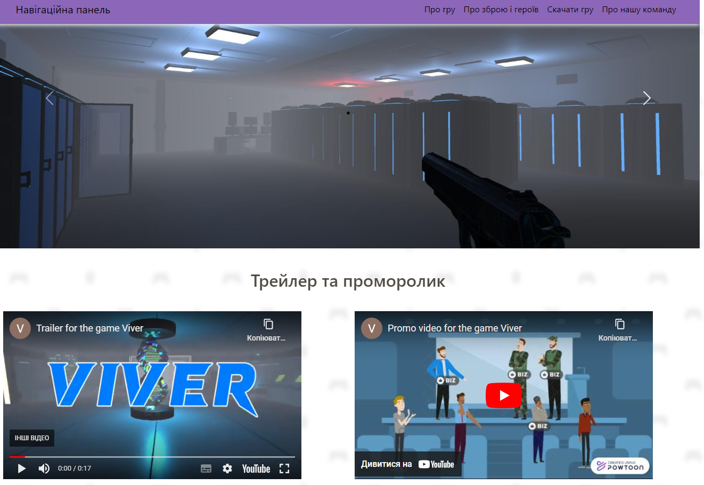
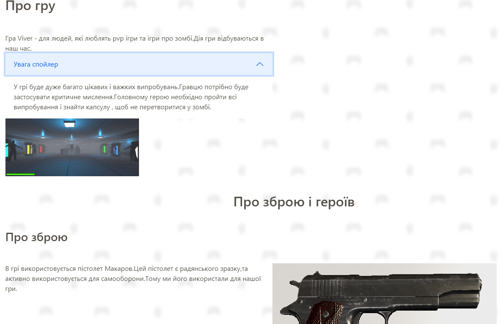

# Viver 🌐

**Viver** is a web project created as part of the web development courses at [Start IT Academy](https://startit.ua/navchalni-programi?gad_source=1&gclid=Cj0KCQjwyL24BhCtARIsALo0fSAGVysCbq1U5qqJvqJU3_t4YhqZamlno8H_EEcc0gGxbvprZwf-xK4aAsCtEALw_wcB). It showcases the use of HTML, CSS, JavaScript, and Bootstrap to build a dynamic and responsive platform. 🚀

## Features ✨

- **Responsive Design:** 📱 The layout adapts to various screen sizes for an optimal viewing experience on mobile, tablet, and desktop devices, utilizing **Bootstrap** for grid and component management.
- **Interactive Elements:** ⚡ JavaScript is used to enhance user interaction, creating a more engaging interface.
- **Clean Code:** 🧹 The project follows best practices for structuring HTML, CSS, and JavaScript to maintain readability and scalability.

## Installation 🛠️

To run this project locally:

1. Clone the repository:
    ```bash
    git clone https://github.com/dmutro76/Viver.git
    ```

2. Navigate to the project folder:
    ```bash
    cd Viver
    ```

3. Open `index.html` in your browser. 🌐

## Technologies Used 🖥️


[](https://github.com/harish-sethuraman/readme-components)

## Screenshots 📸

Here are some screenshots of the project:


---


## License 📄

This project is licensed under the MIT License.
